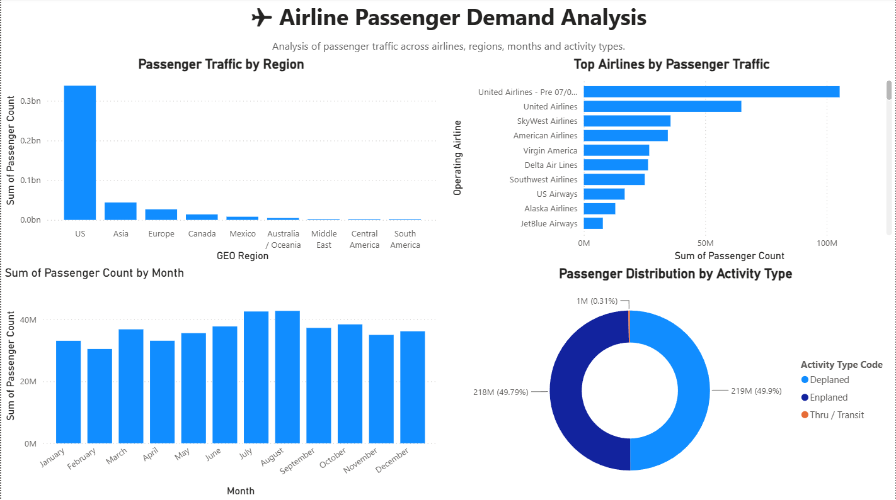
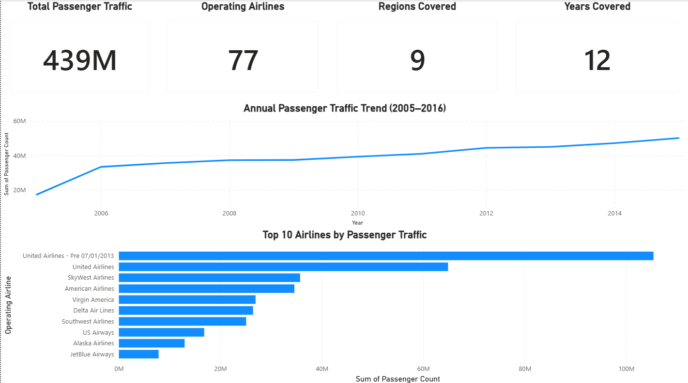
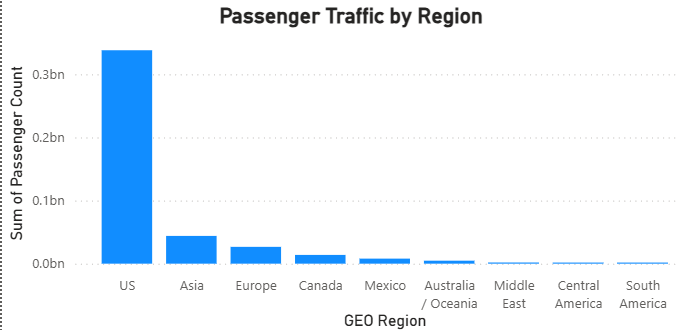
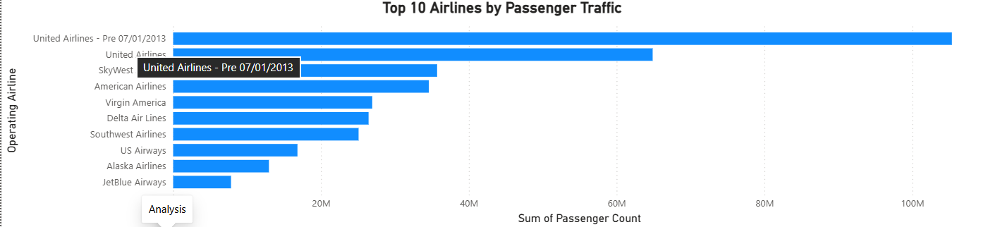
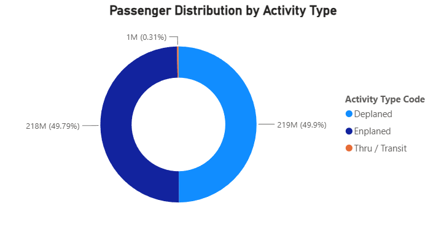
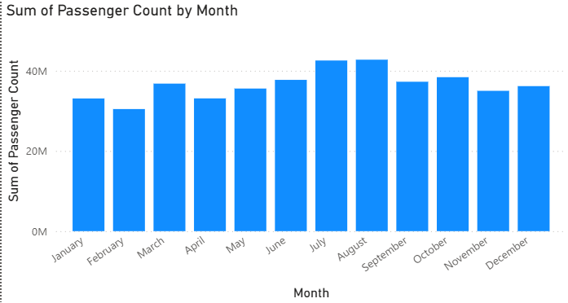

# ✈️ Airline Passenger Demand Analysis

Interactive Power BI dashboard for analyzing airline passenger demand, traffic trends, airline performance, regional insights, and seasonal travel patterns.

---

## 📌 Project Overview

This project analyzes airline passenger traffic using Power BI to identify trends across airlines, regions, months, and activity types. The dashboard enables quick exploration of key performance indicators and supports data-driven decision-making through interactive visualizations.

---

## 🎯 Objectives

- Analyze overall passenger demand.
- Identify the highest-performing airlines.
- Compare passenger traffic across regions.
- Study monthly passenger traffic trends.
- Analyze passenger distribution by activity type.
- Build an interactive dashboard for business insights.

---

## 📊 Dataset

**Source:** Kaggle – Airlines Traffic Passenger Statistics (The Devastator)

The dataset contains airline passenger statistics including:

- Passenger Count
- Operating Airline
- Region
- Activity Period
- Month
- Activity Type
- Terminal
- Boarding Area
- Price Category

---

## 🛠️ Tools & Technologies

- Microsoft Power BI
- Power Query
- DAX
- CSV Dataset
- Data Visualization

---

## 📈 Dashboard KPIs

- **Total Passenger Traffic:** 439 Million
- **Operating Airlines:** 77
- **Regions Covered:** 9
- **Years Covered:** 12

---

# 📷 Dashboard Preview

## Main Dashboard



---

## Analysis Dashboard



---

## Key Visualizations

### Passenger Traffic by Region



### Top 10 Airlines by Passenger Traffic



### Passenger Distribution by Activity Type



### Monthly Passenger Traffic



---

# 🔍 Key Insights

- United Airlines handled the highest passenger traffic.
- The US region contributed the majority of passengers.
- Passenger traffic remained relatively stable with gradual growth across the years analyzed.
- July and August recorded the highest monthly passenger volumes.
- Enplaned and Deplaned passengers contributed almost equally to overall traffic.

---

# 📁 Repository Structure

```
Airline-Passenger-Demand-Analysis
│
├── Airline_Passenger_Demand_Analysis.pbix
├── Air_Traffic_Passenger_Statistics_Data.csv
├── README.md
│
└── Screenshots
    ├── 01_Demand_Dashboard.png
    ├── 02_Analysis_Dashboard.png
    ├── 03_Passenger_Traffic_by_Region.png
    ├── 04_Top_10_Airlines_by_Passenger_Traffic.png
    ├── 05_Passenger_Distribution_by_Activity_Type.png
    └── 06_Monthly_Passenger_Traffic.png
```

---

# ▶️ How to Open

1. Download the repository.
2. Open `Airline_Passenger_Demand_Analysis.pbix` using Microsoft Power BI Desktop.
3. Explore the interactive dashboards and visualizations.

---

# 🚀 Future Improvements

- Add forecasting for passenger demand.
- Include airline market share analysis.
- Build route-wise and airport-wise dashboards.
- Integrate live airline datasets.
- Publish the report to Power BI Service.

---

## 👨‍💻 Author

**Harsh**

Data Analyst | Power BI | SQL | Excel | Python
